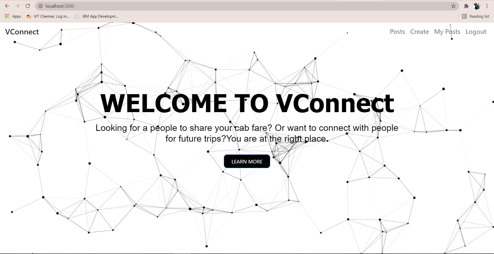
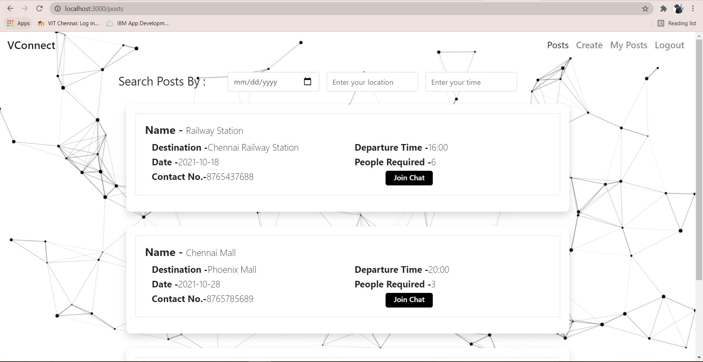
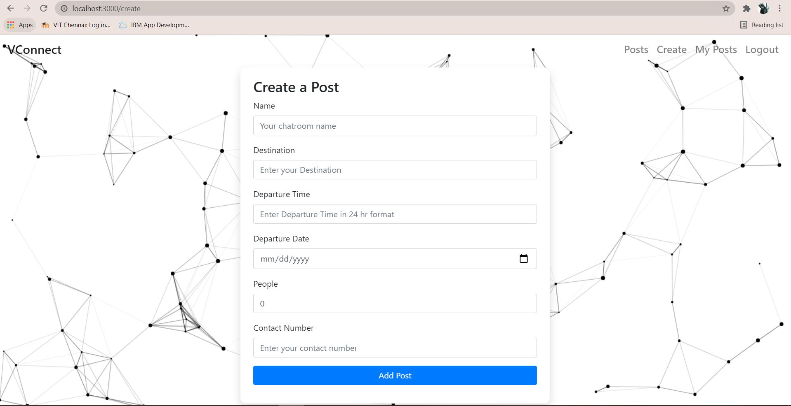
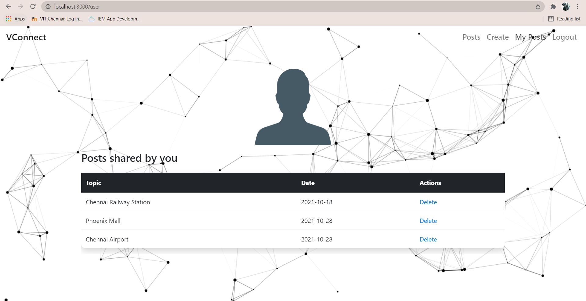
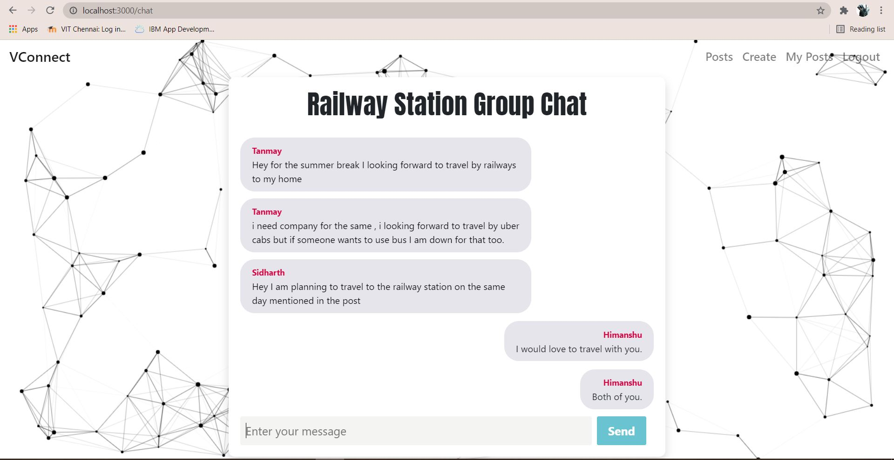

# Vconnect--Cab-Sharing-App

## Preview







# Todo 
 <ul>
  <li>Add additional features for the post creator such as removing users and sharing location using google maps API. </li>
 </ul>
 
## Table of Content
- [Description](#description)
- [Usage](#usage)
- [Issues](#issues)
- [Contribution](#contribution)


## Description
Vconnect is a web platform made for students of VIT chennai to connect with each other for cab sharing.The project was made so as to tackle the high cab prices students have to pay to travel anywhere. The user can create a post specifying their requirement like which destination
,time they are planning to go. This automatically creates
a group chat which others users(who also maybe going to the same place) can join and chat with the creator and other people.I have used JWT authentication for authentication.
. I have also added proper form validation and used React Context API to manage  state. I am using
cookies for storing the token. I have used socket.io for chat functionality. 

## Usage 

1. Fork the repo and then clone it or download it.  

2. Install all the dependencies:
```
 npm install
```

3. To run client
```
 npm start
```
3. To run server
```
 nodemon index
```

## Issues
Feel free to submit issues and enhancement requests.

And if you liked the project, show your support by leaving a 🌟!! 

## Contribution

In general, we follow the "fork-and-pull" Git workflow.

1. Fork the repo on GitHub
2. Clone the project to your own machine
3. Commit changes to your own branch
4. Push your work back up to your fork
5. Submit a Pull request so that we can review your changes
